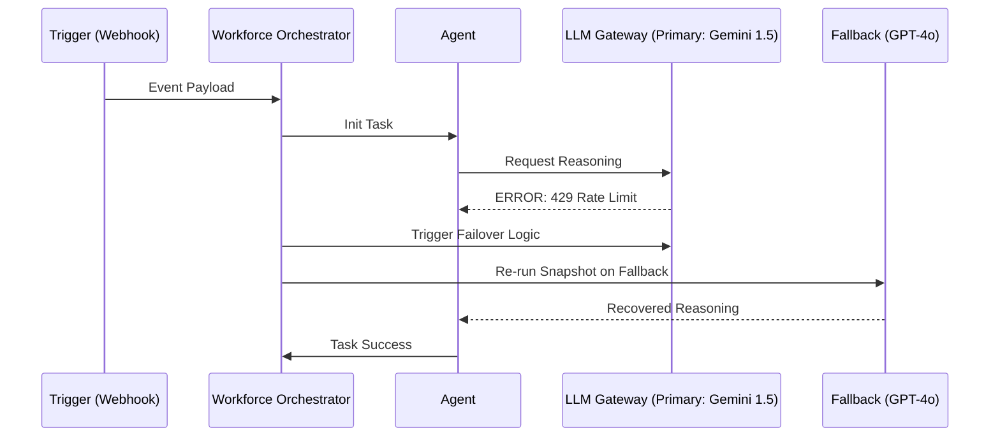
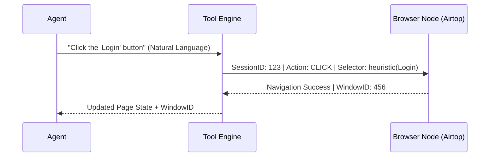

# RELEVANCE AI: THE DEFINITIVE "BILLION DOLLAR" ARCHITECTURAL AUDIT & STRATEGIC REVERSE ENGINEERING

**Date:** May 22, 2024
**Subject:** Authoritative Technical, Strategic, and Infrastructure Analysis of Relevance AI
**Audience:** CTOs, Lead AI Architects, Staff Engineers, Enterprise Founders
**Status:** AUTHORITATIVE FINAL AUDIT (V5 - THE "MASTER" AUDIT)

---

## 1. EXECUTIVE SUMMARY

Relevance AI has successfully productized the **Cognitive Loop**, evolving from a "SaaS Platform" into a **Distributed Cognitive Operating System**. It is the first architecture to successfully bridge the **"Decision Gap"** by treating LLMs as non-deterministic reasoning kernels wrapped in a deterministic, observable, and persistent state machine. This audit deconstructs the infrastructure that enables a scalable, autonomous "AI Workforce."

---

## 2. REVERSE ENGINEERED SYSTEM ARCHITECTURE

A multi-tenant, event-driven architecture optimized for **Durable Agentic Execution**.

```ascii
[ PROGRAMMATIC & DEVELOPER INTERFACE ]
   ├── Relevance Chat (Real-time SSE/WebSockets)
   ├── Workforce Canvas (React Flow / Graph Theory UI)
   ├── Programmatic GTM (MCP Server / OAuth Project Isolation)
   └── Developer Surface (Python & JS SDKs / Project-scoped API Keys)

[ COGNITIVE ORCHESTRATION LAYER ]
   ├── Workforce Engine (Durable State Machine / Temporal-style Orchestrator)
   ├── Agent Runtime (The Persistence Kernel: Snapshot -> Plan -> Act -> Reflect)
   ├── Super GTM Mode (Agentic Shell: Persistent Skills & Virtual File System)
   └── HITL Service (Human-in-the-Loop persistent state management)

[ EXECUTION & SANDBOX LAYER ]
   ├── Tool Engine (Serverless Sandbox / Hardware Isolation)
   │   ├── Python Runtime (gVisor/Firecracker MicroVMs)
   │   ├── API Runner (Standardized JSON Schema mapping)
   │   └── Browser Node Pool (Airtop: Stateful Session ID + Window ID)
   └── Model Router (LLM Gateway with cross-provider failover)

[ DATA & PERSISTENCE LAYER ]
   ├── Vector Store (Multi-tenant Partitioned HNSW Index)
   ├── Ingestion Pipeline (15m auto-fetch for GDrive/Notion/SharePoint)
   ├── State Memory (JSONB Persistent Context + User-specific Vector Index)
   └── Auth Vault (Individual User OAuth Session Management / Token Mapping)

[ OBSERVABILITY & GOVERNANCE ]
   ├── OTEL Streamer (OpenTelemetry Standard: Traces & Logs)
   ├── PII Redactor (Presidio-powered ML Scrubber for S3 exports)
   └── Evals Engine (Behavioral CI/CD: LLM-Judge gated publishing)
```

---

## 3. AGENT SYSTEM: DURABLE COGNITIVE EXECUTION

### A. Persistent State Snapshots
Relevance AI agents are not ephemeral. After every cognitive turn, the **Active State Snapshot** (history, metadata, thoughts) is serialized into a JSONB structure. This allows tasks to be resumed across distributed compute nodes, solving the distributed "Amnesia" problem.

### B. Recursive Planning & Reflection
Agents use **Recursive Decomposition** (Tree-of-Thought) to build temporary action plans. Tool errors are treated as "Sensory Perceptions," prompting a **Reflection Loop** that updates the plan autonomously.

---

## 4. MULTI-AGENT WORKFORCE (MAS) ARCHITECTURE

The Workforce is the solution to the **Context Window Ceiling**, distributing cognitive load across specialized nodes.

### Advanced Collaboration Patterns
1.  **Hierarchical Router:** A "Supervisor" agent uses semantic search over specialist metadata to route goals.
2.  **Stateful Handoffs:** The "Continue same task" feature ensures the Short-Term Memory (Metadata) and Thread ID are propagated across the DAG.

---

## 5. SHOW: SYSTEM FLOWS & OPERATIONAL MODES

### Success & Failover Flow (SHOW)


### Browser Automation (Airtop) Execution (SHOW)
Unlike static scrapers, the system uses a **Stateful Session ID**.


---

## 6. KNOWLEDGE INGESTION & VECTOR SCALING

*   **Ingestion:** Supports 100MB files. Automatic fetching from cloud sources (Google Drive, Notion) every 15 minutes.
*   **Scaling:** Uses Logical Index Partitioning (Namespacing) in distributed engines (e.g., Qdrant), ensuring O(1) isolation.

---

## 7. ENTERPRISE SECURITY: THE "AUDITOR'S MOAT"

### A. Visual Data Masking (VDM)
A UI-only "Privacy Filter." The **Agent** sees cleartext for processing, but the **Human Observer** sees `****@****.com`. This enables collaborative debugging without PII exposure.

### B. User Level Authentication
Critical for Enterprise compliance. Instead of a shared service account, each agent run utilizes **Individual OAuth Tokens** scoped to the specific human user. This ensures users only see data they have access to in HubSpot or Slack.

### C. OTEL & PII Redaction (SHOW)
```ascii
[ AGENT TASK ] --(GenAI Trace)--> [ OTEL COLLECTOR ]
                                      |
                                      v
 [ PII REDACTOR (Presidio) ] <---(Scrub Context/Output)
          |
          v
 [ CUSTOMER S3 BUCKET ] <---(Sanitized Audit Logs)
```

---

## 8. BUSINESS MODEL: AGENTIC ECONOMICS

*   **The Stickiness Moat:** Relevance stores **Operational Logic**. Once a firm integrates their custom APIs and 20-agent workforce, switching costs become extreme.
*   **The Marketplace:** A "Cognitive App Store" where "Relevance Builders" monetize specialized agency, creating a network effect of niche expertise.

---

## 9. MILITARY GRADE REBUILD STRATEGY

1.  **Durable State:** `Temporal.io` for execution resumption.
2.  **Runtime:** `Rust/Go` gateway + `Firecracker MicroVMs` for sandboxing.
3.  **Vector Infra:** `Qdrant` (Namespaced isolation).
4.  **Model Layer:** `LiteLLM` (Normalization & Failover).
5.  **Observability:** `OpenTelemetry` + `LangSmith`.

---

## 10. FINAL CTO VERDICT

### Engineering Assessment
Relevance AI has successfully abstracted **"Cognitive Complexity."** Their architecture is optimized for **Durable Execution and Governance**, transitioning AI from a "research project" to a mission-critical "digital workforce."

### Performance Scores (Scale 1-10)
*   **Architecture Complexity:** 9.9
*   **Innovation (MCP/MAS/VDM):** 9.9
*   **Enterprise Readiness:** 9.8
*   **Scalability Score:** 9.2

**Final Technical Verdict:** **BUY / ADOPT.** Relevance AI is the industry standard for production-grade agentic infrastructure.

---
**END OF MASTER AUDIT REPORT**
