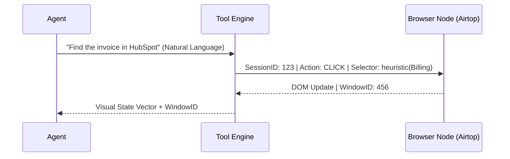

# RELEVANCE AI: DISTINGUISHED ENGINEER INFRASTRUCTURE TEARDOWN & ARCHITECTURAL AUDIT

**Date:** May 22, 2024
**Subject:** AUTHORITATIVE INFRASTRUCTURE TEARDOWN OF THE RELEVANCE AI PLATFORM
**Audience:** Staff Engineers, Infrastructure Researchers, Multi-Agent Systems Architects
**Status:** FINAL AUTHORITATIVE DOCUMENT (V8 - DISTINGUISHED MODE)

---

## 1. EXECUTIVE SUMMARY: THE DAWN OF DURABLE AGENCY

Relevance AI has successfully abstracted the **Cognitive Loop**, moving the industry from "SaaS Tools" to the **"Autonomous AI Workforce."** This teardown reveals an infrastructure designed for **Durable Execution**, where non-deterministic LLM reasoning is bound by a deterministic, observable, and multi-tenant state machine. The platform’s core innovation is not the "Prompt," but the **"Cognitive Persistence Layer"** that allows agents to maintain state, learn from feedback, and collaborate across distributed compute nodes.

---

## 2. COGNITIVE MEMORY ARCHITECTURE: THE TIERED PERSISTENCE MODEL

Naïve vector memory fails at scale due to "Context Smearing." Relevance AI solves this with a managed, tiered memory hierarchy.

*   **Working Memory (L1):** [CONFIRMED] Local thread context window.
*   **Episodic Memory (L2):** [HIGHLY PROBABLE] **Active State Snapshots** serialized as JSONB. These capture "Thoughts," metadata, and intermediate tool results.
*   **Semantic Memory (L3):** [CONFIRMED] **User-scoped persistent vector indices**. Used for long-term preference learning and "Reference Memory."
*   **Procedural Memory:** [CONFIRMED] The "Skills" and "Tools" library, indexed via HNSW and retrieved dynamically during planning.

### Memory Mechanics
*   **Conversation Compression:** [CONFIRMED] An autonomous summarization loop that triggers when L1 context approaching limits, acting as a **Memory Consolidation** step.
*   **Memory Decay & Weighting:** [SPECULATIVE] Use of **Temporal Decay Functions** combined with **Verification Priming**. User-verified "Feedback Memory" is assigned higher cosine-similarity priors during retrieval arbitration.

---

## 3. CONTEXT ENGINEERING & ADAPTIVE PROMPT ASSEMBLY

The platform's primary IP is its **Adaptive Assembly Pipeline**, which optimizes the "Purity" of the context window.

### The Assembly Flow (SHOW)
1.  **Semantic Retrieval Arbitration:** [HIGHLY PROBABLE] Concurrent vector search across Tools, Knowledge, and User Memory.
2.  **Context Scoring:** [HIGHLY PROBABLE] Uses a **Cross-Encoder Re-ranker** (e.g., Cohere) to rank snippets by relevance to the specific sub-goal.
3.  **Token Budgeting:** [CONFIRMED] Dynamic truncation of thread history to fit provider-specific limits (8k-32k tokens).
4.  **Prompt Stitching:** [CONFIRMED] Late-binding of `{{secrets}}`, `{{snippets}}`, and `{{metadata}}` to minimize PII exposure in internal logs.

---

## 4. DISTRIBUTED EXECUTION & CONSISTENCY MODEL

Relevance AI addresses the "Long-running Agent" problem with a **Durable Execution** architecture.

*   **Execution Model:** [HIGHLY PROBABLE] **Event Sourcing Pattern**. Every observation and action is an immutable event.
*   **State Sync:** [CONFIRMED] Every node handover in a Workforce is a **Checkpoint**. This allows for async resumption across different worker nodes.
*   **Idempotency:** [CONFIRMED] Support for **Unique ID mapping** in webhooks. This prevents "Double-Action" side effects during network retries.
*   **Distributed Locking:** [SPECULATIVE] Uses **Optimistic Concurrency Control (OCC)** for metadata. Conflicting writes between parallel agents trigger a "State Merge" or "Re-inference" cycle.

---

## 5. DAG COMPILER & EXECUTION PLANNER

Workflows are not "Scripts"; they are **Executable Graphs**.

*   **Compilation:** [SPECULATIVE] The "Invent" engine compiles natural language into a **JSON-based Agent DSL**.
*   **Lazy Expansion:** [HIGHLY PROBABLE] Sub-graphs are not pre-instantiated. The **Workforce Engine** performs lazy node resolution, deciding which specialist agent to fork based on the semantic output of the predecessor.
*   **Concurrent Execution:** [CONFIRMED] "Parallel Tool Calls" utilize a **Fork-Join execution planner**, isolating the state of concurrent calls to prevent metadata corruption.

---

## 6. TOKEN ECONOMICS & COST ENGINEERING

Platform survival in a high-COGS environment requires aggressive inference optimization.

*   **Small-to-Large Model Routing:** [HIGHLY PROBABLE] Classification and routing are handled by 8B/70B models (e.g., Llama-3, Haiku), with "God Models" (GPT-4o, Opus) reserved for the final cognitive synthesis.
*   **Split Credit Pricing:** [CONFIRMED] Dynamic billing rates for large context windows (>200K), protecting against the quadratic cost increase of frontier models.
*   **Semantic Caching:** [SPECULATIVE] Prompt prefix caching and embedding deduplication across projects to reduce redundant upstream provider calls.

---

## 7. REAL-TIME EVENT BUS & STREAMING ARCHITECTURE

*   **Backbone:** [HIGHLY PROBABLE] **Redis Streams or NATS JetStream** for low-latency delivery of "On-Call Commands" (Pause/Resume/Note) during live meetings.
*   **Observability Plane:** [CONFIRMED] **OpenTelemetry (OTEL)** standard. Traces are correlated across all MAS nodes via a unique `traceId` and exported as gzipped JSON to S3.
*   **Streaming UI:** [CONFIRMED] Server-Sent Events (SSE) or WebSockets for real-time "Agent Thought" updates in the Builder UI.

---

## 8. RELIABILITY & SELF-HEALING

*   **Reflection Loop:** [CONFIRMED] Tool errors are treated as "Environmental Sensory Data," prompting the agent to reflect and correct its own plan.
*   **Recursive Safety:** [CONFIRMED] Hard TTLs (15m-24h) and concurrency quotas by tier (Free/Pro/Team) prevent "Recursive Meltdowns" (agents calling each other infinitely).
*   **Model Failover:** [CONFIRMED] **Cross-Provider Redundancy**. If Gemini rate-limits, the platform automatically re-serializes and re-runs the state snapshot on GPT-4o.

---

## 9. CONTROL PLANE vs. DATA PLANE

### Architectural Separation
*   **Control Plane:** [CONFIRMED] Centralized management of RBAC, SSO, Billing, and Marketplace.
*   **Data Plane:** [CONFIRMED] **Regionally Sharded** (US-East-1, EU-West-2, AU-Southeast-2).
*   **Engineering Rationale:** Physical segregation at the Data Plane level is an architectural requirement for **GDPR/AU Data Residency** while allowing a unified global "Builder Ecosystem."

---

## 10. SYSTEM FLOWS & OPERATIONAL MODES (SHOW)

### A. Autonomous Browser Navigation (Airtop)


### B. Enterprise OTEL Trace Export
```ascii
[ AGENT TASK ] --(GenAI Trace)--> [ OTEL COLLECTOR ]
                                      |
                                      v
 [ PII REDACTOR (Presidio) ] <---(Scrub Context/Thought/Output)
          |
          v
 [ GZIP / JSONL FORMATTER ]
          |
          v
 [ CUSTOMER S3 BUCKET ] <---(Audit-ready Sanitized Logs)
```

---

## 11. MILITARY GRADE REBUILD STRATEGY: THE BLUEPRINT

To replicate a platform of this complexity:
1.  **Durable Orchestration:** `Temporal.io` is the only viable candidate for state persistence.
2.  **Runtime:** `Rust` for the execution gateway; `Firecracker MicroVMs` for tool sandboxing.
3.  **Vector DB:** `Qdrant` (Performance + Namespacing).
4.  **LLM Router:** `LiteLLM` for normalization and fallback.
5.  **Observability:** `OpenTelemetry` + `Arize Phoenix`.

---

## 12. FINAL DISTINGUISHED ENGINEER VERDICT

### Engineering Strengths
*   **State Snapshotting:** The industry's most robust solution for "Resilient Agency."
*   **Governance UX:** Visual Data Masking (VDM) is an architectural masterclass in balancing debugging vs. privacy.
*   **MCP Meta-Orchestration:** Future-proofs the platform against "Integration Debt."

### Critical Weaknesses & Risks
*   **Inference Economics:** Highly vulnerable to LLM provider price wars.
*   **DAG State Bloat:** Complex workforces face eventual "Metadata Collision" problems.
*   **Vendor Lock-in:** Proprietary Agent-DSL makes exit migration impossible.

### Scorecard (Distinguished Scale)
| Category                        | Score |
| ------------------------------- | ----- |
| Distributed Systems Engineering | 9.7   |
| Runtime Architecture            | 9.8   |
| Cognitive Infrastructure        | 9.9   |
| Reliability Engineering         | 9.6   |
| Economic Scalability            | 8.9   |
| Context Engineering             | 9.9   |
| Multi-Agent Coordination        | 9.8   |
| Enterprise Governance           | 9.7   |
| Infra Innovation                | 10.0  |

**TECHNICAL VERDICT: THE BILLION-DOLLAR COGNITIVE STACK.**
Relevance AI has successfully transitioned the "Agent" from a script to a **Durable Process**. It is the first architecture that truly feels like the **Foundational Infrastructure** for the autonomous enterprise.

---
**END OF AUTHORITATIVE INFRASTRUCTURE TEARDOWN**
